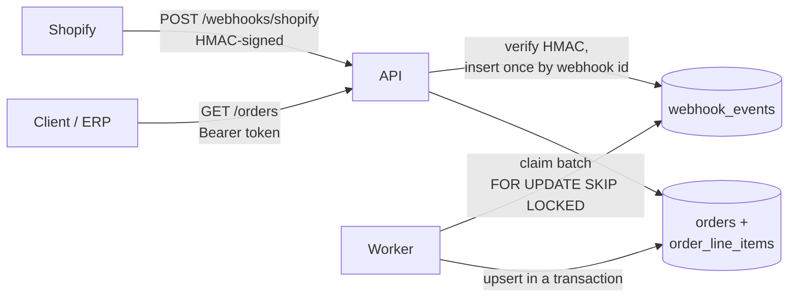

# shopify-order-sync

A small backend service that receives Shopify order webhooks, stores them durably in Postgres, processes them with a background worker, and serves the synced orders through an authenticated REST API.

It's the pattern I use when a store's order data has to reach another system (ERP, CRM, reporting, a B2B portal) reliably, and it's written to show how I handle the parts that usually go wrong: signature checks, duplicate and out-of-order deliveries, retries, and pagination.

**Stack:** Node.js 22 · TypeScript · Fastify · PostgreSQL · Zod · Vitest · GitHub Actions · Docker

## Architecture



The API and the worker are separate processes that share only the database:

1. **Ingest fast.** The webhook route verifies the signature, stores the raw payload, and returns `200`. Shopify expects a response within 5 seconds and retries otherwise, so no business logic runs in the request.
2. **Process asynchronously.** The worker claims due events, validates each payload, and writes the order and its line items in one transaction per event.
3. **Read through a stable API.** Clients page through orders using keyset cursors.

## Design decisions

| Problem | How it's handled | Where |
|---|---|---|
| Forged requests | HMAC-SHA256 of the **raw** body, compared with `timingSafeEqual`. The raw-body parser is scoped to the webhook route only. | `src/hmac.ts`, `src/app.ts` |
| Shopify redelivers the same webhook | `UNIQUE (webhook_id)` + `ON CONFLICT DO NOTHING`; a redelivery is acknowledged and ignored. | `src/events.ts` |
| Deliveries arrive out of order | The order upsert only applies when the incoming `updated_at` is newer than the stored one, so a stale `orders/updated` can't overwrite fresh data. | `src/orders.ts` |
| Several workers running at once | `FOR UPDATE SKIP LOCKED` hands each event to exactly one worker without a separate queue service. | `src/events.ts` |
| A worker crashes mid-batch | Claiming an event pushes `available_at` forward as a lease; if the worker dies, the event becomes due again. | `src/events.ts` |
| Transient failures | Exponential backoff (30s, 60s, 120s ... capped at 1h), then `failed` after `WORKER_MAX_ATTEMPTS`. | `src/worker.ts` |
| Payloads that can never succeed | Invalid payloads and unknown topics fail immediately instead of burning retries. | `src/worker.ts` |
| One bad event in a batch | Each event runs in its own transaction; a failure rolls back only that event's writes. | `src/worker.ts` |
| Deep pagination | Keyset pagination on `(created_at, id)` with an opaque cursor, backed by a matching index. No `OFFSET` scans, no duplicates when new orders arrive. | `src/orders.ts`, `migrations/` |
| Money and IDs | `NUMERIC` in the database and returned as strings; Shopify's 64-bit IDs never pass through a JS float. | `src/orders.ts` |
| Bad configuration | Environment is validated with Zod at startup and fails with a readable list of problems. | `src/config.ts` |

## API

| Method | Path | Auth | Description |
|---|---|---|---|
| `POST` | `/webhooks/shopify` | Shopify HMAC | Receives `orders/create`, `orders/updated`, `orders/paid`, `orders/cancelled`, `orders/fulfilled`, `orders/delete` |
| `GET` | `/orders?shop=&limit=&cursor=&financial_status=` | Bearer | Newest first, `limit` 1–100, returns `{ orders, nextCursor }` |
| `GET` | `/orders/:id?shop=` | Bearer | One order with its line items |
| `GET` | `/healthz` | none | Database connectivity check |

```bash
curl -H "Authorization: Bearer $API_TOKEN" "http://localhost:3000/orders?shop=demo.myshopify.com&limit=20"
```

## Running it

With Docker (Postgres, migrations, API and worker):

```bash
docker compose up --build
```

Without Docker, against your own Postgres:

```bash
cp .env.example .env      # set DATABASE_URL, SHOPIFY_WEBHOOK_SECRET, API_TOKEN
npm install
npm run migrate
npm run dev               # API on :3000
npm run dev:worker        # in a second terminal
npm run smoke             # sends a signed webhook and waits for the worker to sync it
```

## Tests

```bash
npm test
```

The tests run against **real Postgres** via [PGlite](https://pglite.dev) (Postgres compiled to WASM, in-process), so `ON CONFLICT`, `SKIP LOCKED`, row-value comparisons and transactions are exercised as written, with no Docker needed locally. They cover signature verification, idempotent ingestion, stale-update protection, retry/backoff and dead-lettering, transaction rollback, pagination without gaps, and shop scoping.

CI runs two jobs: typecheck + tests, then an end-to-end job that builds the app, migrates a Postgres 17 service container, starts the API and worker as separate processes, and runs `scripts/smoke.mjs` against them.

## Project layout

```
src/
  app.ts            Fastify routes: webhook ingestion + read API
  hmac.ts           Shopify signature verification
  events.ts         Event store and queue: record, claim, retry, fail
  worker.ts         Batch processing, topic handlers, backoff
  orders.ts         Order upsert, keyset pagination, detail query
  shopify-order.ts  Zod schema for the order payload subset
  db.ts             Small database interface over node-postgres
  migrate.ts        Forward-only SQL migration runner
  config.ts         Environment validation
migrations/         SQL schema
test/               Vitest suites (PGlite)
scripts/smoke.mjs   End-to-end check used by CI
```

## What I'd add for production

- Register webhooks through the Admin API on app install, and fetch the order from the Admin API during processing, not only from the webhook body.
- A periodic reconciliation job that pulls orders updated since the last sync, to catch any webhooks Shopify gave up on.
- Metrics on queue depth, event age and failure rate, with alerting on `failed` events.
- A small admin endpoint to replay `failed` events after a fix is deployed.
- Per-shop API tokens instead of one shared token.

## License

MIT
